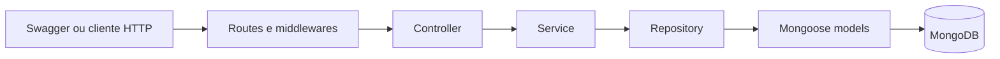

# IncidentHub

IncidentHub é uma API REST para registrar e acompanhar incidentes que afetam serviços e sistemas. O projeto foi desenvolvido para a primeira entrega da disciplina de Programação Web Back-end do curso de Engenharia de Software.

## Objetivo

Demonstrar, em uma aplicação executável, o uso de Node.js, Express, MongoDB, Mongoose, autenticação JWT, autorização por papéis, validação de entrada, documentação OpenAPI, testes HTTP e organização modular de back-end.

## Funcionalidades da Entrega 1

- cadastro e login com JWT;
- consulta do usuário autenticado;
- autorização com os papéis `ADMIN`, `ENGINEER` e `VIEWER`;
- CRUD de serviços monitorados;
- CRUD de incidentes com severidade, status, serviços afetados e responsáveis;
- filtros por severidade, status, serviço e responsável;
- paginação de incidentes;
- health check da API e do MongoDB;
- documentação interativa pelo Swagger;
- seed idempotente para demonstração;
- tratamento e formato global de erros.

## Tecnologias

- Node.js e Express 5
- MongoDB e Mongoose
- bcryptjs e JSON Web Token
- Zod
- Helmet e Morgan
- Swagger UI e OpenAPI 3
- Node.js Test Runner, Supertest e MongoDB Memory Server
- Docker e Docker Compose
- ESLint e Prettier

## Arquitetura

Cada módulo separa transporte HTTP, regras de negócio e persistência. Controllers traduzem HTTP, services aplicam regras e repositories concentram consultas ao MongoDB.



Fluxo principal:

```text
route → controller → service → repository → model/MongoDB
```

O módulo `health` não precisa de repository ou model porque consulta apenas o estado da conexão mantida pelo Mongoose. O script de seed acessa os models diretamente por ser uma ferramenta de inicialização de dados, fora do fluxo HTTP.

## Estrutura de diretórios

```text
src/
├── config/                  # ambiente, banco e documento OpenAPI
├── middlewares/             # autenticação, autorização e erros
├── modules/
│   ├── auth/                # cadastro e login
│   ├── health/              # estado da aplicação
│   ├── incidents/           # incidentes, filtros e paginação
│   ├── services/            # sistemas monitorados
│   └── users/               # usuários e papéis
├── shared/
│   ├── errors/              # AppError
│   ├── security/            # bcrypt e JWT
│   └── validation/          # validação reutilizável
├── app.js                   # configuração do Express
├── seed.js                  # dados de demonstração
└── server.js                # processo HTTP e ciclo de vida

test/
└── api.e2e.test.js          # suíte HTTP da Entrega 1
```

## Modelagem MongoDB

| Documento  | Campos principais                                                                         | Decisões                                                                                                     |
| ---------- | ----------------------------------------------------------------------------------------- | ------------------------------------------------------------------------------------------------------------ |
| `User`     | name, email, password, role, timestamps                                                   | Email único; password selecionado somente no login e removido de toda serialização                           |
| `Service`  | name, description, status, timestamps                                                     | Nome único e status operacional controlado por enum                                                          |
| `Incident` | title, description, severity, status, affectedServices, assignedTo, createdBy, timestamps | Serviços e usuários são referências porque possuem ciclo de vida próprio e são consultados em outros módulos |

Incidentes usam índices compostos para os filtros oferecidos pela API:

- `status + createdAt`;
- `severity + createdAt`;
- `affectedServices + createdAt`;
- `assignedTo + createdAt`;
- `createdAt` para a listagem geral.

`affectedServices` exige ao menos um serviço válido e não aceita duplicidades. `createdBy` é obtido do JWT. `assignedTo` aceita somente usuários `ADMIN` ou `ENGINEER`. Um serviço associado a incidente não pode ser removido, evitando referências órfãs.

## Autenticação e autorização

O login retorna um token JWT assinado com `HS256`. Endpoints protegidos esperam:

```http
Authorization: Bearer <token>
```

| Operação                           | ADMIN | ENGINEER | VIEWER |
| ---------------------------------- | ----- | -------- | ------ |
| Ler serviços e incidentes          | Sim   | Sim      | Sim    |
| Criar, alterar ou remover serviços | Sim   | Não      | Não    |
| Criar ou alterar incidentes        | Sim   | Sim      | Não    |
| Remover incidentes                 | Sim   | Não      | Não    |
| Consultar usuário por id           | Sim   | Não      | Não    |

Cadastros públicos recebem sempre o papel `VIEWER`, impedindo autoelevação de privilégio. Senhas são armazenadas exclusivamente como hash bcrypt e nunca aparecem nas respostas.

## Endpoints principais

| Método   | Endpoint             | Acesso              | Descrição                          |
| -------- | -------------------- | ------------------- | ---------------------------------- |
| `GET`    | `/health`            | Público             | Saúde da API e conexão com o banco |
| `POST`   | `/api/auth/register` | Público             | Cadastra um `VIEWER`               |
| `POST`   | `/api/auth/login`    | Público             | Retorna o JWT                      |
| `GET`    | `/api/users/me`      | Autenticado         | Usuário atual                      |
| `GET`    | `/api/users/:id`     | `ADMIN`             | Consulta um usuário                |
| `POST`   | `/api/services`      | `ADMIN`             | Cadastra serviço                   |
| `GET`    | `/api/services`      | Autenticado         | Lista serviços                     |
| `GET`    | `/api/services/:id`  | Autenticado         | Consulta serviço                   |
| `PATCH`  | `/api/services/:id`  | `ADMIN`             | Atualiza serviço                   |
| `DELETE` | `/api/services/:id`  | `ADMIN`             | Remove serviço sem incidentes      |
| `POST`   | `/api/incidents`     | `ADMIN`, `ENGINEER` | Registra incidente                 |
| `GET`    | `/api/incidents`     | Autenticado         | Lista, filtra e pagina incidentes  |
| `GET`    | `/api/incidents/:id` | Autenticado         | Consulta incidente                 |
| `PATCH`  | `/api/incidents/:id` | `ADMIN`, `ENGINEER` | Atualiza incidente                 |
| `DELETE` | `/api/incidents/:id` | `ADMIN`             | Remove incidente                   |

Exemplo de listagem filtrada:

```http
GET /api/incidents?severity=CRITICAL&status=INVESTIGATING&page=1&limit=20
```

O limite máximo é 100 itens por página.

## Como executar localmente

Requisitos: Node.js 20.19+ ou 22.13+ e uma instância do MongoDB.

```bash
git clone <url-do-repositorio>
cd incident-hub
cp .env.example .env
npm install
npm start
```

No PowerShell, copie o ambiente com:

```powershell
Copy-Item .env.example .env
```

Antes de iniciar, substitua `JWT_SECRET` em `.env` por um valor aleatório com ao menos 32 caracteres. Em desenvolvimento com recarga automática, use `npm run dev`.

## Docker

Com Docker Desktop em execução, o MongoDB local não é necessário:

```bash
cp .env.example .env
docker compose up --build
```

No PowerShell:

```powershell
Copy-Item .env.example .env
docker compose up --build
```

A API estará em `http://localhost:3000` e o Swagger em `http://localhost:3000/api/docs`. O volume `mongodb_data` preserva os dados entre reinicializações.

Para encerrar:

```bash
docker compose down
```

## Variáveis de ambiente

| Variável             | Obrigatória    | Padrão        | Descrição                                     |
| -------------------- | -------------- | ------------- | --------------------------------------------- |
| `NODE_ENV`           | Não            | `development` | `development`, `test` ou `production`         |
| `PORT`               | Não            | `3000`        | Porta HTTP entre 1 e 65535                    |
| `MONGODB_URI`        | Sim            | —             | URI `mongodb://` ou `mongodb+srv://`          |
| `JWT_SECRET`         | Sim            | —             | Segredo JWT com ao menos 32 caracteres        |
| `JWT_EXPIRES_IN`     | Não            | `1h`          | Número seguido de `s`, `m`, `h` ou `d`        |
| `BCRYPT_ROUNDS`      | Não            | `12`          | Custo bcrypt entre 4 e 15                     |
| `SEED_USER_PASSWORD` | Apenas no seed | —             | Senha temporária dos usuários de demonstração |

O repositório contém somente placeholders. Não use os valores de exemplo em produção.

## Seed de demonstração

O seed é idempotente: pode ser executado novamente sem duplicar seus usuários, serviços ou incidentes. A senha não possui valor padrão e deve ser informada durante a execução.

Execução local no PowerShell:

```powershell
$env:SEED_USER_PASSWORD = '<SuaSenhaForte123>'
npm run seed
```

Execução local em Bash:

```bash
SEED_USER_PASSWORD='<SuaSenhaForte123>' npm run seed
```

Com Docker e o ambiente já iniciado:

```bash
docker compose run --rm -e SEED_USER_PASSWORD='<SuaSenhaForte123>' seed
```

O seed cria os seguintes usuários, todos com a senha informada no comando:

| Email                        | Papel      |
| ---------------------------- | ---------- |
| `admin@incidenthub.local`    | `ADMIN`    |
| `engineer@incidenthub.local` | `ENGINEER` |
| `viewer@incidenthub.local`   | `VIEWER`   |

Também são criados `Payments API`, `Authentication API`, `Customer API`, `Notification Service` e quatro incidentes com severidades e status diferentes.

## Testes e qualidade

A suíte usa um MongoDB temporário e não altera o banco configurado em `.env`.

```bash
npm test
npm run lint
npm run format:check
```

Para executar todas as verificações em sequência:

```bash
npm run check
```

Os testes cobrem autenticação, proteção de senha, roles, CRUDs, validações, referências, filtros, paginação, headers de segurança e integridade do OpenAPI.

## Swagger/OpenAPI

- Interface: `GET /api/docs`
- Documento JSON: `GET /api/docs.json`

Fluxo sugerido para a apresentação:

1. consulte `/health`;
2. execute o seed;
3. faça login como `admin@incidenthub.local`;
4. copie `accessToken` da resposta;
5. clique em **Authorize** e informe somente o token;
6. consulte e crie serviços;
7. crie, consulte, filtre e atualize incidentes;
8. autentique como `viewer@incidenthub.local` e tente alterar um recurso para demonstrar `403`;
9. envie um enum ou email inválido para demonstrar `400`;
10. conclua removendo um incidente de demonstração ou alterando seu status para `RESOLVED`.

## Decisões técnicas relevantes

- JavaScript com ES Modules mantém a configuração direta e adequada ao escopo acadêmico.
- Zod valida bodies, parâmetros e queries antes dos controllers.
- Erros usam `{ "error": { "code", "message", "details?" } }` em todos os módulos.
- O limite de JSON é 100 KB; payloads maiores retornam `413`.
- Helmet adiciona headers HTTP de segurança. A política CSP é desabilitada para permitir os scripts inline do Swagger UI; os demais headers permanecem ativos.
- Logs HTTP não incluem bodies, senhas ou tokens.
- A API consulta o usuário a cada requisição autenticada, portanto mudanças de papel e exclusões têm efeito imediato.
- O documento OpenAPI é modularizado junto aos domínios maiores para permanecer legível.

## Possíveis evoluções — Entrega 2

Possíveis extensões futuras incluem timeline, comentários, audit log, postmortems, analytics, dashboards, notificações e atualizações em tempo real. Esses recursos fazem parte do roadmap e não estão implementados nesta entrega.
